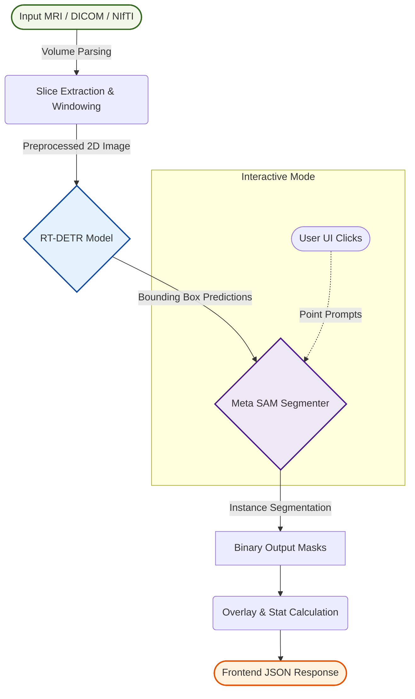

# RT-DETR+SAM Pipeline: General System Workflow

## 1. Introduction
RT-DETR+SAM Pipeline is a comprehensive system designed for the automated and interactive detection and segmentation of brain tumors from medical imaging data. The system employs a modern client-server architecture where a React-based frontend communicates with a high-performance FastAPI backend. The core intelligence of the system is driven by a sequential pipeline of two state-of-the-art deep learning models: Real-Time Detection Transformer (RT-DETR) and Meta's Segment Anything Model (SAM).

## 2. End-to-End Architectural Workflow
The overall workflow of the application can be divided into the following sequential stages. The visual flowchart below represents the high-level architecture of the RT-DETR+SAM Pipeline.

### 2.1. Data Ingestion and Preprocessing
- **Client Upload:** The user uploads a 2D image (PNG/JPG) or a 3D medical volume (DICOM/NIfTI) via the React frontend.
- **API Reception:** The FastAPI server receives the file via a multipart/form-data request.
- **Slice Extraction (For 3D Data):** If the input is a 3D medical volume, the system utilizes `nibabel` or `pydicom` to parse the volumetric data. The user can specify a `slice_index`, and the system extracts the corresponding 2D axial slice.
- **Windowing (Hounsfield Unit Mapping):** Radiometric transformations (window center and window width) are applied to the raw pixel data to optimize contrast for soft-tissue structures, converting it into an 8-bit representation suitable for neural network inference.

### 2.2. Object Detection (RT-DETR)
- The preprocessed 2D slice is passed to the **RT-DETR** model.
- RT-DETR performs rapid bounding-box detection, identifying regions of interest (ROIs) that potentially contain tumors or anomalies.
- The model outputs bounding box coordinates $(x_{min}, y_{min}, x_{max}, y_{max})$, confidence scores, and class labels.

### 2.3. Zero-Shot Segmentation (Meta SAM)
- The bounding boxes generated by RT-DETR act as spatial prompts for the **Segment Anything Model (SAM)**.
- SAM uses these box prompts to perform precise zero-shot instance segmentation, generating high-resolution binary masks for the detected anomalies.
- Alternatively, the system supports an **Interactive Mode**, where the user manually provides point coordinates (clicks) on the UI. These points are sent to the backend and used as point prompts for SAM, bypassing the RT-DETR stage.

### 2.4. Post-processing and Visualization
- **Mask Extraction:** The binary masks are extracted and their geometric properties (e.g., area in pixels) are calculated.
- **Overlay Generation:** A composite visualization is created by blending the original image, bounding boxes, and segmentation masks with high-contrast color overlays.
- **Serialization:** The resulting masks and overlay images are converted to Base64 strings to ensure seamless and fast transmission over HTTP without requiring persistent static file hosting.

### 2.5. Client Rendering
- The backend responds with a structured JSON payload containing the Base64 images, detection metadata, and execution statistics.
- The React frontend parses this payload, updates the centralized Zustand store, and dynamically updates the UI (Canvas overlays, statistical tables, and JSON viewers) to present the results to the user.
