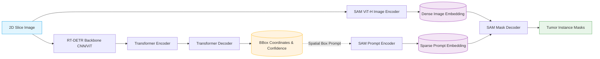

# Machine Learning Pipeline Workflow

This document outlines the architecture and execution flow of the core machine learning modules. The following diagram illustrates how the RT-DETR detection model interacts with the Meta SAM segmentation model.

## 1. `backend/ml/pipeline.py`
The `DETRSAMPipeline` class acts as the central orchestrator, bridging the gap between detection and segmentation.

### 1.1. Automated Pipeline (`run_on_image`)
1. **Image Loading:** Reads the preprocessed 2D slice using OpenCV.
2. **Detection Phase:** Passes the image to the `DetectionModel` instance, which returns bounding box coordinates.
3. **Segmentation Phase:** Iterates through the detected bounding boxes and passes them as prompts to the `SegmentationModel` instance.
4. **Aggregation:** Combines the bounding boxes, confidence scores, and binary masks.
5. **Visualization & I/O:** Calls visualization utilities to draw overlays and saves the artifacts to the temporary output directory. Returns a structured `PipelineResult` dataclass.

### 1.2. Interactive Pipeline (`run_interactive_prompt`)
1. **Prompt Mapping:** Accepts direct `[x, y]` coordinates from the UI.
2. **Segmentation Phase:** Queries the `SegmentationModel` using point prompts instead of box prompts.
3. **Aggregation & I/O:** Saves the generated masks and interactive overlays.

## 2. `backend/ml/detection.py`
This module encapsulates the Ultralytics RT-DETR implementation.

### Workflow:
1. **Initialization:** Loads the `.pt` weights into the specified device context.
2. **Inference (`predict`):** 
   - Executes the forward pass on the input image.
   - Applies Non-Maximum Suppression (NMS) internally via the Ultralytics API.
   - Filters the results based on the provided `conf_threshold`.
   - Converts the resulting bounding box tensors from the GPU back to CPU memory as NumPy arrays for further processing.

## 3. `backend/ml/segmentation.py`
This module wraps Meta's Segment Anything Model (SAM).

### Workflow:
1. **Initialization:** Loads the SAM architecture (`vit_h`, `vit_l`, or `vit_b`) and instantiates the `SamPredictor`.
2. **Feature Extraction (`set_image`):** Before applying prompts, the image is passed through the heavy Vision Transformer (ViT) backbone to compute the image embeddings. This is done only once per image to optimize performance.
3. **Prompt Decoding (`predict_masks` / `predict_masks_with_points`):** 
   - For box prompts, the coordinates are fed into the lightweight mask decoder.
   - For point prompts, the point coordinates and labels are used.
   - The model generates binary masks which are then thresholded and converted to boolean NumPy arrays.
